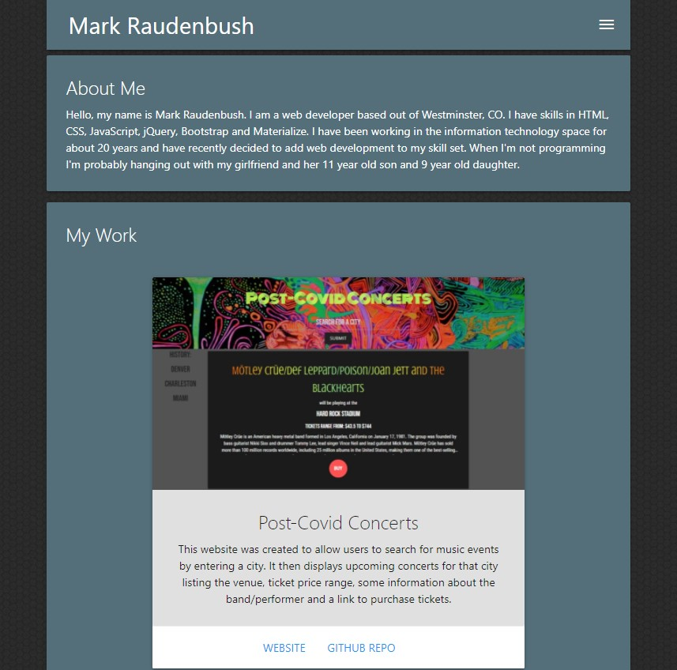
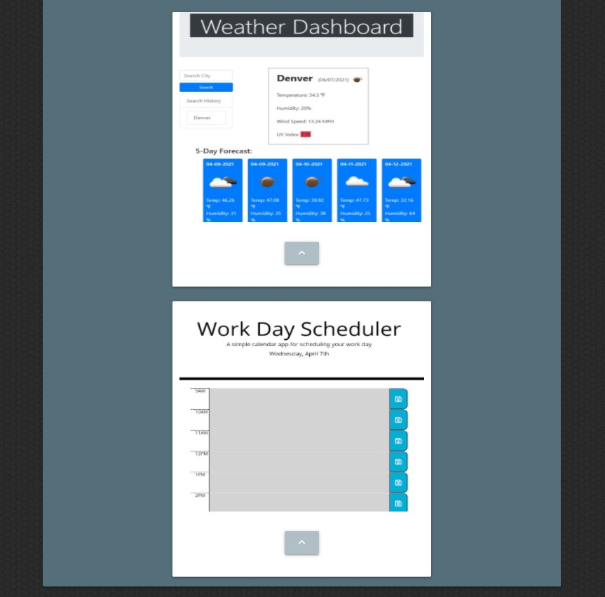
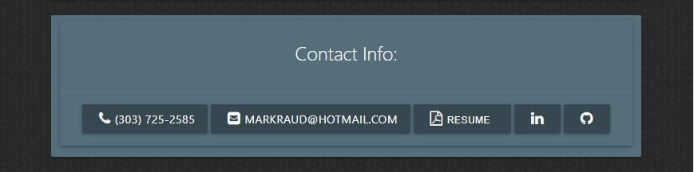

# mr-portfolio
Developer Portfolio

### Overview:
This portfolio was created during the University of Denver Coding Boot Camp.  I has examples of some of the work I've done including links to the GitHub repos and links to the sites. 

#### Code: 
The website is built with:
1. HTML
2. Materialize CSS
3. Javascript

#### Links:

- [Link to the portfolio](https://markraud.github.io/mr-portfolio/).

- [Link to GitHub Repository](https://github.com/markraud/mr-portfolio).

#### Screenshots of the site:

#### License:
Built by Mark Raudenbush
markraud@hotmail.com
- [My LinkedIn](https://www.linkedin.com/in/markraudenbush)
- [My GitHub](https://github.com/markraud?tab=stars)

#### License:
The MIT License (MIT)

#### Summary:

This was an update/rebuild of a previous portfolio.  This project helped me understand the Materialize CSS framework and the mobile first approch to design/development.
